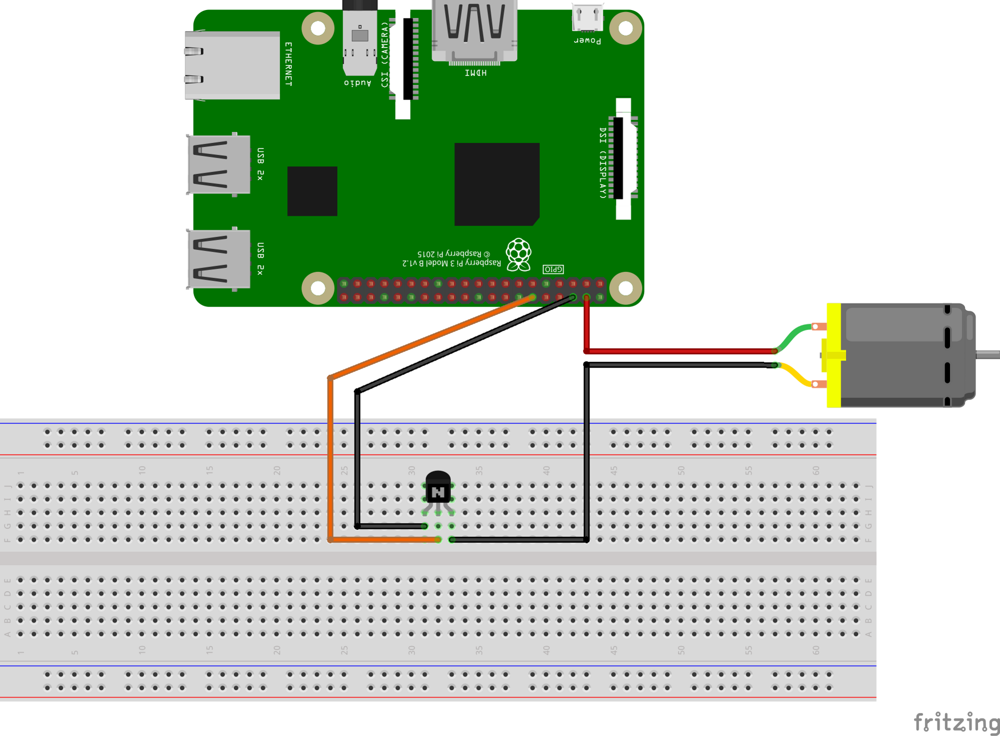

# Raspberry Pi Fan Control

Simple Python and shell scripts to run a fan based on CPU temperature for your Raspberry Pi. 

## The Setup

This setup uses GPIO pin 18 with an NPN Transistor (S8050). Wiring diagrams 
for this setup are provided in the `wiring_diagrams` directory, with an image 
of the most basic setup below.

### Basic Wiring Diagram

## Running on Boot

Here's how to run this script automatically on boot:
- Modify the shell script to ensure you have the correct path _run-fan.py_.
- Make the files executable using _sudo chmod a+x run-fan.py_ and _sudo chmod a+x launcher.sh_.
- Use crontab (or another method) to execute _launcher.sh_ on boot. 

### Helpful Links

The code included in this repository is mainly the work of others, with some modification 
and adaptations made to the code to document the approach. 

- [How to control a fan to cool the CPU of your RaspBerryPi](https://hackernoon.com/how-to-control-a-fan-to-cool-the-cpu-of-your-raspberrypi-3313b6e7f92c)
- [Execute Script on Start Up](https://raspberrypi.stackexchange.com/questions/8734/execute-script-on-start-up)

=======
Thanks to [@vollman-ariel](https://github.com/vollmann-ariel) for providing a 
wiring diagram which includes an additional resistor. 
